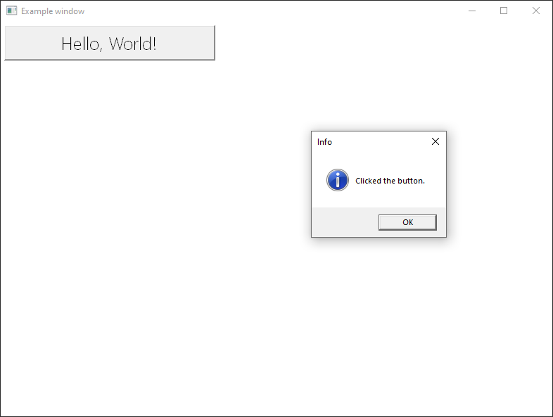

# NadWin

WinAPI GUI Library (kind of a wrapper).



## Usage

Example (MSVC):

```cpp
#include "NadWin/src/NadWin.hpp"

#pragma comment(lib, "Comctl32.lib")

#if defined _M_IX86
#pragma comment(linker,"/manifestdependency:\"type='win32' name='Microsoft.Windows.Common-Controls' version='6.0.0.0' processorArchitecture='x86' publicKeyToken='6595b64144ccf1df' language='*'\"")
#elif defined _M_IA64
#pragma comment(linker,"/manifestdependency:\"type='win32' name='Microsoft.Windows.Common-Controls' version='6.0.0.0' processorArchitecture='ia64' publicKeyToken='6595b64144ccf1df' language='*'\"")
#elif defined _M_X64
#pragma comment(linker,"/manifestdependency:\"type='win32' name='Microsoft.Windows.Common-Controls' version='6.0.0.0' processorArchitecture='amd64' publicKeyToken='6595b64144ccf1df' language='*'\"")
#else
#pragma comment(linker,"/manifestdependency:\"type='win32' name='Microsoft.Windows.Common-Controls' version='6.0.0.0' processorArchitecture='*' publicKeyToken='6595b64144ccf1df' language='*'\"")
#endif

int main()
{
    namespace UI = NW::UI;

    UI::App app("Example app");
    UI::Window window(L"Example window", CW_USEDEFAULT, CW_USEDEFAULT, 800, 600);
    
    UI::Button button(&window, UI::Position(5, 5, 300, 50), L"Hello, World!");
    button.EventHandler = [&window](UI::ControlEventTypes eventType, UI::ControlEventInfo* eventInfo) {
        switch (eventType)
        {
        case NW::UI::ControlEventTypes::FromParent_Command:
            MessageBoxW(window.Hwnd(), L"You clicked the button!", L"Info", MB_OK | MB_ICONINFORMATION);
            break;
        default:
            break;
        }
    };

    window.Show();

    app.MessageLoop();
}
```
